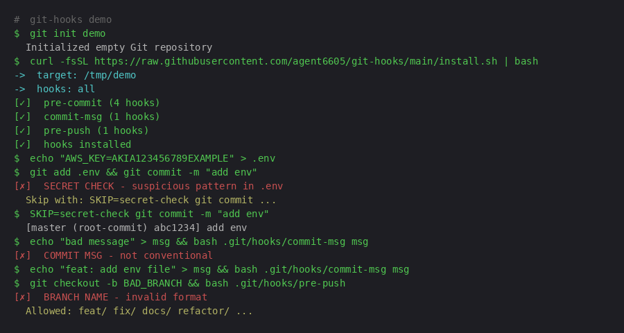

# git-hooks · zero-dep, one-command commit guards

<p align="center">
  
  <br>
  <em>Replay live: <code>asciinema play assets/demo.cast</code></em>
</p>

```bash
curl -fsSL https://raw.githubusercontent.com/agent6605/git-hooks/main/install.sh | bash
```

**No npm. No Python. No Docker.** Plain bash hooks that work in any repo — JavaScript, Go, Rust, Python, whatever. Drop them in and they run.

## Hooks

| Hook | Stage | What it does |
|------|-------|-------------|
| `secret-check` | pre-commit | Blocks AWS keys, GitHub tokens, private keys, API secrets |
| `no-large-files` | pre-commit | Prevents files >1MB (catches bloat before it lands) |
| `no-merge-conflict` | pre-commit | Catches leftover `<<<<<<<` / `=======` / `>>>>>>>` markers |
| `trailing-whitespace` | pre-commit | Auto-strips trailing whitespace, re-stages the fix |
| `conventional` | commit-msg | Enforces `type(scope): message` format |
| `branch-name` | pre-push | Validates branch names: `feat/`, `fix/`, `chore/`, etc. |
| `auto-deps` | post-checkout | Runs `npm install` / `bundle install` when lockfiles change |

## Install

**One repo:**
```bash
curl -fsSL https://raw.githubusercontent.com/agent6605/git-hooks/main/install.sh | bash
```

**Specific hooks only:**
```bash
bash install.sh --hooks secret-check,conventional,branch-name
```

**Symlink mode (auto-update on pull):**
```bash
bash install.sh --link
```

**Different repo:**
```bash
bash install.sh --dir ~/code/other-project
```

## Skip a hook

```bash
SKIP=secret-check git commit -m "wip: testing"
SKIP=secret-check,conventional git push
```

## Uninstall

```bash
rm .git/hooks/{secret-check,no-large-files,no-merge-conflict,trailing-whitespace,conventional,branch-name,auto-deps}
```

Or nuke them all:
```bash
rm .git/hooks/pre-commit .git/hooks/commit-msg .git/hooks/pre-push .git/hooks/post-checkout
```

## Why not husky / lefthook / pre-commit?

| | git-hooks | husky | lefthook | pre-commit |
|---|---|---|---|---|
| Dependencies | **none** | Node + npm | Ruby/Go | Python + pip |
| Install | 1 curl | npm install | gem/go install | pip install |
| Works offline | yes | yes | yes | yes |
| Config file | none (convention) | .husky/ | lefthook.yml | .pre-commit-config.yaml |
| Speed | instant | ~200ms overhead | ~100ms overhead | ~500ms overhead |
| Language agnostic | yes | JS-first | yes | Python-first |

**Bottom line:** Use husky/lefthook if you need complex pipelines. Use this if you want zero-config, zero-dep guards that just work.

## Adding custom hooks

Drop any executable script into `.git/hooks/` with the right name:
- `pre-commit` — runs before commit
- `commit-msg` — receives message file path as `$1`
- `pre-push` — runs before push
- `post-checkout` — runs after checkout

See [Git hooks docs](https://git-scm.com/docs/githooks).

## License

MIT
